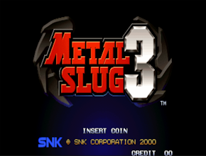
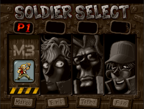
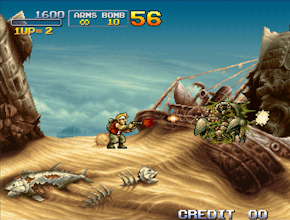
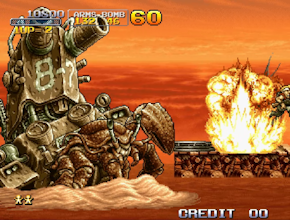

<h1>Metal Slug 3 모작 프로젝트</h1>
이 프로젝트는 원작인 Metal Slug 3를 모작한 2D 횡스크롤 런앤건 게임입니다. 
Unity를 활용하여 Metal Slug 시리즈의 감성을 재현하는 데 중점을 두었습니다.

## 스크린샷

|  |  |
|:---:|:---:|
| 시작 화면 | 캐릭터 선택 화면 |

|  |  |
|:---:|:---:|
| 플레이 화면 | 보스전 화면 |

## 목차
  - [개요](#개요) 
  - [개발 환경](#개발-환경)
  - [링크](#링크)
  - [프로젝트 특징](#프로젝트-특징)
  - [구현한 컨텐츠](#구현한-컨텐츠)

## 개요
- **개발 기간:** 2024.04.09 ~ 2024.04.19(약 2주)
- **프로젝트 유형:** 개인 프로젝트

## 개발 환경
- **개발 엔진 및 언어:** Unity 2021.3.36f1 LTS, C#
- **IDE:** Visual Studio 2022, Jetbrains Rider

## 링크
- **포트폴리오:** https://drive.google.com/file/d/1eykZsrngO9aDtMbm_sdVfZ1JJDzVr5dH/view?usp=sharing
- **시연 영상:** https://youtu.be/wugsjCvAQr4

## 프로젝트 특징
- **원작의 감성을 재현:** Metal Slug 3의 그래픽과 사운드를 최대한 모방하여 원작의 느낌을 살림.
- **효율적인 자원 관리:** Object Pooling을 사용해 발사체와 같은 자원들을 효과적으로 관리하여 성능을 최적화.
- **충돌 처리 개선:** Layer Collision Matrix 및 Raycast를 활용하여 정밀한 충돌 감지 및 처리 구현.
- **카메라와 사운드 시스템:** Cinemachine을 사용하여 카메라 이동 및 영역 제한을 구현하고, Audio Mixer Group을 통해 여러 사운드를 동시에 재생 가능하도록 처리.

## 구현한 콘텐츠

### 플레이어 이동 및 상태 관리
- 달리기, 웅크리기, 점프 등 플레이어의 기본 동작 구현
- 플레이어가 피격 시 사망 및 리스폰 처리, 리스폰 후 일정 시간 동안 무적 상태 유지

### 공격 시스템
- 피스톨, 머신건, 나이프, 수류탄 등을 활용한 근거리 및 원거리 공격 구현
- Object Pooling을 사용하여 투사체 관리

### 적 AI
- 플레이어 감지 및 추적 기능 구현
- 체력에 따라 다른 페이즈를 가진 보스 등장

### 이벤트 시스템 및 충돌 감지
- 맵의 특정 위치에 도달하면 적 생성 및 다음 구역 해방 이벤트 발생
- Layer Collision Matrix 및 Raycast를 활용한 충돌 감지 및 처리

### 카메라 및 사운드
- Cinemachine을 사용하여 카메라 이동 및 영역 제한 구현
- Audio Mixer Group을 통해 배경음악과 효과음을 동시에 재생 가능하도록 조정
